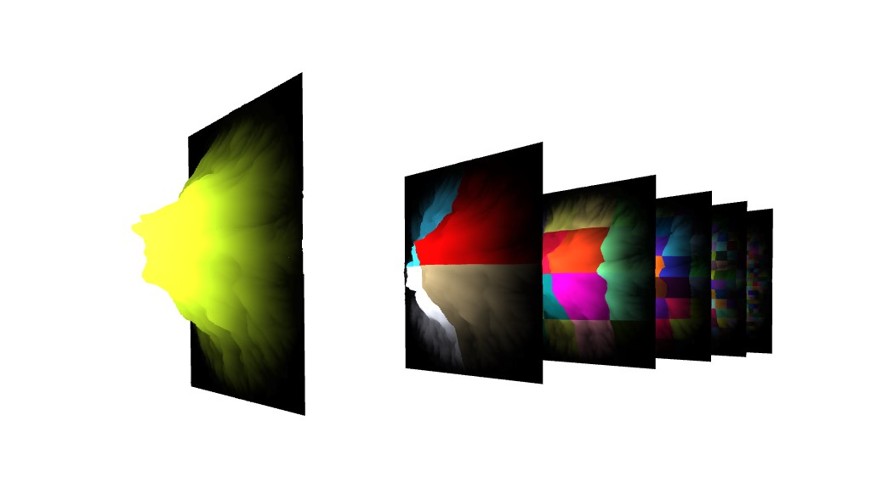

***This is actively developed so things are buggy and will break***

# Quad
Quad is an InstanceMesh quadTree. Meaning one high-resolution quad that can be used for all quads at each levels.
The benefits are better performance because you can get a high number of quads with high resolution on the screen.
seams are still present but minimal, and  no more buffering because child quads were created on the fly.


## Installation
This is a vanilla three.js standalone module.

```bash
git clone https://github.com/miguelmyers8/instanceQuad.git
```

## Usage
Quad class take as input size Of staring Quad, resolution, a reference to your canvas, and the number of levels for your quadtree.
```javascript

import Quad from './quad/quad'
const canvasRef = // a reference to your canvas element that holds your gray scaled height map
const quad = new Quad(3000,500,canvasRef,5);
scene.add(quad.quadTree.instaMesh);

//in your update loop
quad.quadTree.update(playerObjectOrCameraObject,quad.quadTree.instaData[0])
```
Here is 1 InstanceMesh quad with 341 child instance, at a resolution of 500, 5 levels deep.


### To Do
- [ ] unit test
- [ ] culling
- [ ] seams
- [ ] delete redundant code
- [ ] multithread initialization
- [ ] fragment shader controls to change color
- [ ] indexdb for cashing vertices
- [ ] issue with root level initialization (might have to rewrite buildQuadTree method)
- [x] weird artifacts that show up in wireframe mode (I think this problem is due to the fact I scale the mesh to 0 for toggling viability)

## Contributing
Pull requests are welcome. For major changes, please open an issue first to discuss what you would like to change.

## License
[bsd-4-clause](choosealicense.com/licenses/bsd-4-clause/)
